# 🌍 Language Fundamentals — How Computers Understand Us

A simple guide to understand **Markup, JSON, YAML, Programming, Scripting, and Query languages** —  
and how they all fit together in modern web systems.

---

## 🧱 1. Markup Languages — *Describing Structure*

**Definition:**  
A **markup language** adds structure and meaning to text.  
It tells the computer *what each piece is*, not *what to do*.

Think of it as **labels on boxes**, not instructions.

### 🔤 Common Examples

| Language | Purpose | Example |
|-----------|----------|----------|
| **HTML** | Defines structure of web pages | `<h1>Hello</h1>` |
| **XML** | Describes and stores data | `<book><title>Harry Potter</title></book>` |
| **Markdown** | Formats text documents | `# Heading` or `**bold**` |

---

### 🧩 Visualization

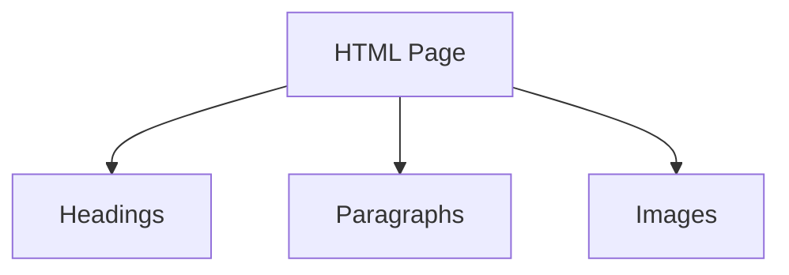

**Key idea:**  
Markup describes content. It is **descriptive**, not **prescriptive**.

---

## 🌐 1.5 Web Servers — *The Restaurant of the Internet*

### 🍽️ What is a Web Server?

A **web server** is like a restaurant waiter who:
1. Takes your order (receives your request)
2. Goes to the kitchen (finds the files)
3. Brings your food (sends the webpage back)

### 🏪 Real-World Analogy

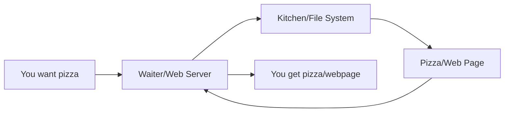

### 📦 Common Web Servers

| Server | Like... | Used by | Special Power |
|--------|---------|---------|---------------|
| **Apache** | The veteran waiter | WordPress sites | Very flexible |
| **Nginx** | The speed champion | Netflix, Airbnb | Super fast |
| **IIS** | Microsoft's waiter | .NET applications | Windows integration |
| **Node.js** | The multitasker | Real-time apps | Also runs JavaScript |

### 🔄 How Web Servers Work

1. **You type:** `www.example.com`
2. **Browser asks:** "Hey server, give me the homepage!"
3. **Server thinks:** "Let me find index.html"
4. **Server sends:** HTML, CSS, JavaScript files
5. **Browser shows:** The beautiful webpage

```bash
# What happens behind the scenes:
GET /index.html HTTP/1.1
Host: www.example.com

# Server responds:
HTTP/1.1 200 OK
Content-Type: text/html
<html>...</html>
```

### 🎮 Static vs Dynamic Servers

| Static Server | Dynamic Server |
|---------------|----------------|
| Like a vending machine | Like a chef |
| Gives pre-made files | Cooks fresh content |
| Just HTML/CSS/JS files | Runs Python/PHP/Node.js |
| Example: GitHub Pages | Example: YouTube |

### 💻 Simple Web Server Example

```python
# Python web server in 3 lines!
from http.server import HTTPServer, SimpleHTTPRequestHandler

server = HTTPServer(('localhost', 8000), SimpleHTTPRequestHandler)
server.serve_forever()
# Now visit http://localhost:8000
```

```javascript
// Node.js web server
const http = require('http');

const server = http.createServer((req, res) => {
  res.writeHead(200, {'Content-Type': 'text/html'});
  res.end('<h1>Hello from my server!</h1>');
});

server.listen(3000);
// Visit http://localhost:3000
```

### 🏠 Local vs Remote Servers

| Local Server (localhost) | Remote Server (web hosting) |
|-------------------------|---------------------------|
| On YOUR computer | On the internet |
| Address: localhost:3000 | Address: www.site.com |
| For development | For everyone to access |
| Like cooking at home | Like a public restaurant |

---

## 🌳 2. The DOM — *How Browsers Understand Markup*

### 📖 What is the DOM?

Think of the DOM like a **family tree** or **organizational chart** of your web page. When a browser reads your HTML, it creates a **living, breathing map** in memory.

**Analogy:** If HTML is a recipe, the DOM is the actual meal laid out on the table where you can touch and change things.

```html
<html>
  <body>
    <h1>Hello</h1>
    <p>Welcome to my page</p>
  </body>
</html>
```

### 🌲 DOM Tree Visualization

```mermaid
graph TD
  A[HTML] --> B[BODY]
  B --> C[H1 → "Hello"]
  B --> D[P → "Welcome to my page"]
```

### 🎮 Why the DOM Matters

The DOM is **interactive**. JavaScript can:
- Find elements (like finding a person in a phone book)
- Change content (like editing a Word document)
- Add/remove elements (like rearranging furniture)
- React to clicks (like a doorbell)

Example:

```html
<h1 id="greet">Hello</h1>
<button onclick="changeGreeting()">Click me!</button>

<script>
  function changeGreeting() {
    // The DOM lets us grab and change elements
    document.getElementById("greet").innerText = "Hi there!";
  }
</script>
```

### 🔍 DOM vs HTML

| HTML | DOM |
|------|-----|
| Static text file | Living memory structure |
| Like a blueprint | Like the actual building |
| Can't change itself | Can be modified anytime |
| Just describes | Actually IS the page |

---

## ⚡ 2.5 The Virtual DOM — *React's Smart Assistant*

### 🤔 Why Virtual DOM?

**The Problem:** Changing the real DOM is SLOW. It's like renovating your house every time you want to move a chair.

**The Solution:** React creates a **lightweight copy** of the DOM in JavaScript memory.

### 🏠 Analogy: The Interior Designer

Imagine you want to redecorate your room:

1. **Without Virtual DOM (Traditional way):**
   - You move each piece of furniture one by one
   - Paint walls immediately
   - Very tiring and slow

2. **With Virtual DOM (React way):**
   - You draw your plan on paper first
   - Compare with current room layout
   - Only move what's different
   - Much faster!

### 🔄 How It Works

```javascript
// React component
function Greeting() {
  const [name, setName] = useState("World");
  
  return (
    <div>
      <h1>Hello {name}!</h1>
      <button onClick={() => setName("React")}>
        Change Name
      </button>
    </div>
  );
}
```

**What happens when you click:**

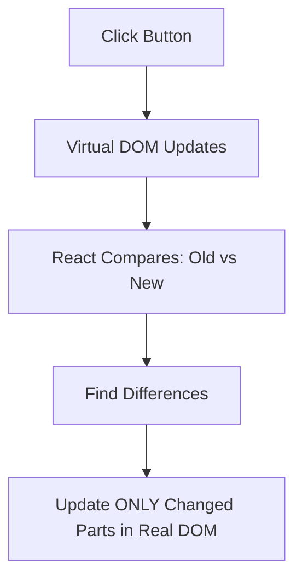

### 🎯 Virtual DOM vs Real DOM

| Real DOM | Virtual DOM |
|----------|-------------|
| Heavy, slow to change | Lightweight JavaScript object |
| Like moving real furniture | Like drawing on paper |
| Every change = full repaint | Smart updates only |
| Browser's responsibility | React's responsibility |

### 💡 Simple Example

```javascript
// This is what React does behind the scenes:

// 1. Virtual DOM before click
const virtualBefore = {
  type: 'h1',
  props: { children: 'Hello World!' }
};

// 2. Virtual DOM after click
const virtualAfter = {
  type: 'h1',
  props: { children: 'Hello React!' }  // Only this changed
};

// 3. React compares and updates ONLY the text content
// Much faster than replacing the whole element!
```

**Think of it as:** React is your smart assistant who plans all changes on a notepad before touching the actual webpage.

---

## 📦 3. Data Serialization — *Storing and Sharing Data*

### 🧾 JSON (JavaScript Object Notation)

- Designed for **machines to read and write** easily.
- Commonly used for **APIs** and **data exchange**.

```json
{
  "name": "Umer",
  "age": 35,
  "skills": ["Python", "Next.js", "AI"]
}
```

---

### 📜 YAML (YAML Ain’t Markup Language)

- More human-friendly than JSON.  
- Used in **configuration files** (like Docker, GitHub Actions).

```yaml
name: Umer
age: 35
skills:
  - Python
  - Next.js
  - AI
```

---

### 💬 Comparison

| Feature | JSON | YAML | XML (Markup) |
|----------|------|------|--------------|
| Purpose | Data transfer | Configurations | Document structure |
| Readability | Medium | High | Medium |
| Comments allowed | ❌ | ✅ | ✅ |
| File type | `.json` | `.yml` | `.xml` |

---

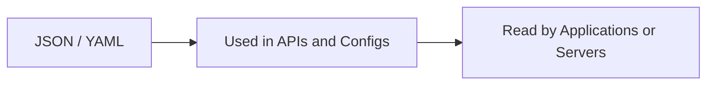

---

## 🧠 4. Descriptive vs Prescriptive Code

| Type | Meaning | Also Called | Example |
|------|----------|-------------|----------|
| **Descriptive** | Says *what something is* | Declarative | HTML, JSON, SQL |
| **Prescriptive** | Says *what to do and how* | Imperative / Procedural | Python, JavaScript, Bash |

🧩 Example:
```html
<!-- Descriptive -->
<p>This is a paragraph.</p>

<!-- Prescriptive -->
<script> alert("This is an action!"); </script>
```

---

## 💻 5. Programming Languages — *Telling the Computer What to Do*

Programming languages are **prescriptive** — they **give instructions** step by step.

| Language | Type | Role | Example |
|-----------|------|-------|----------|
| **Python** | General purpose | Backend, AI, Automation | `print("Hello")` |
| **JavaScript** | Web scripting | Browser, Frontend | `alert("Hi!")` |
| **C# / Java** | Compiled | Applications, Servers | `System.out.println("Hello");` |

---

### ⚙️ What They Need to Run

| Language | Requires | Example Environment |
|-----------|-----------|-----------------------|
| **Python** | Interpreter | Run: `python script.py` |
| **JavaScript** | Browser or Node.js | Run in Chrome or Node |
| **C#** | Compiler + .NET runtime | Run via Visual Studio or .NET SDK |
| **HTML / CSS** | Browser | Chrome, Firefox |
| **SQL** | Database engine | MySQL, PostgreSQL |
| **Bash / PowerShell** | Command-line shell | Terminal, PowerShell |

---

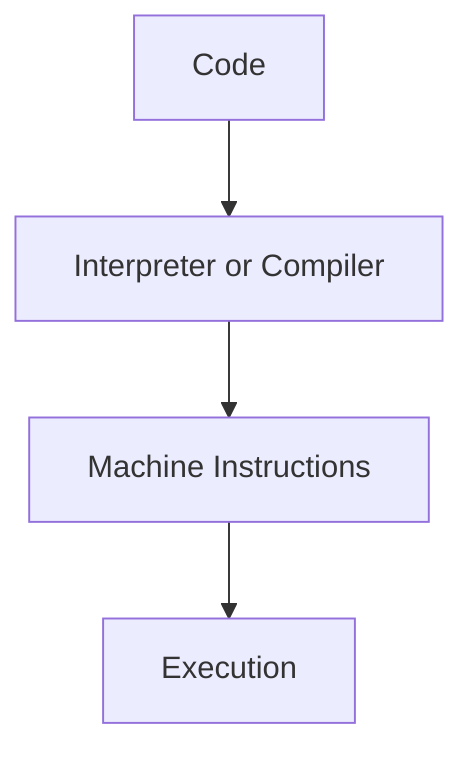

---

## 🗃️ 6. Query Languages — *Talking to Databases*

### 💬 SQL (Structured Query Language)

**Purpose:** Retrieve and manipulate data in databases.

```sql
SELECT name, age
FROM users
WHERE age > 30;
```

- **Declarative** (you describe *what you want*, not *how* to do it)
- Requires a **database server** like MySQL, PostgreSQL, or SQL Server

---

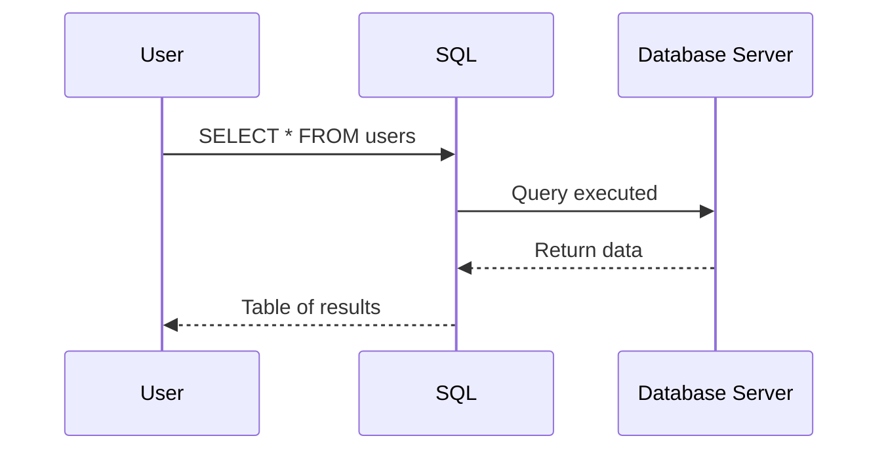

---

## 🖥️ 7. Shell Scripting — *Talking to the Operating System*

### 🐧 Bash (Linux / macOS)

- Commands for automating OS tasks.
- Common in DevOps, servers, and CI/CD.

```bash
echo "Deploying App"
cd /project
python3 app.py
```

---

### 🪟 PowerShell (Windows)

- Similar to Bash but **object-based**.
- Used to manage Windows systems and automation.

```powershell
Write-Output "Deploying App"
Set-Location "C:\project"
python app.py
```

---

### ⚖️ Bash vs PowerShell

| Feature | Bash | PowerShell |
|----------|------|-------------|
| Platform | Linux/macOS | Windows (now cross-platform) |
| Syntax | Text-based | Object-based |
| File extension | `.sh` | `.ps1` |
| Typical use | DevOps, servers | System administration |
| Example command | `ls` | `Get-ChildItem` |

---

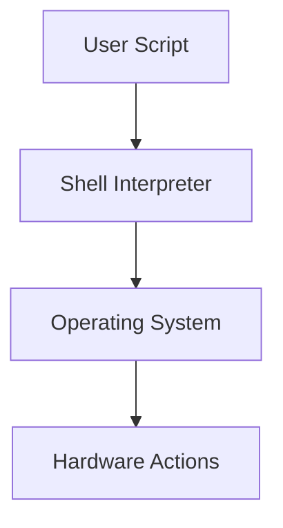

---

## 🎭 7.5 Shell Profiles — *Your Personal Settings*

### 🏠 What are Shell Profiles?

Think of profiles like your **personal locker** at school:
- Stores your preferences
- Loads automatically when you log in
- Different profiles for different situations

### 🐧 Bash Profiles (Linux/macOS)

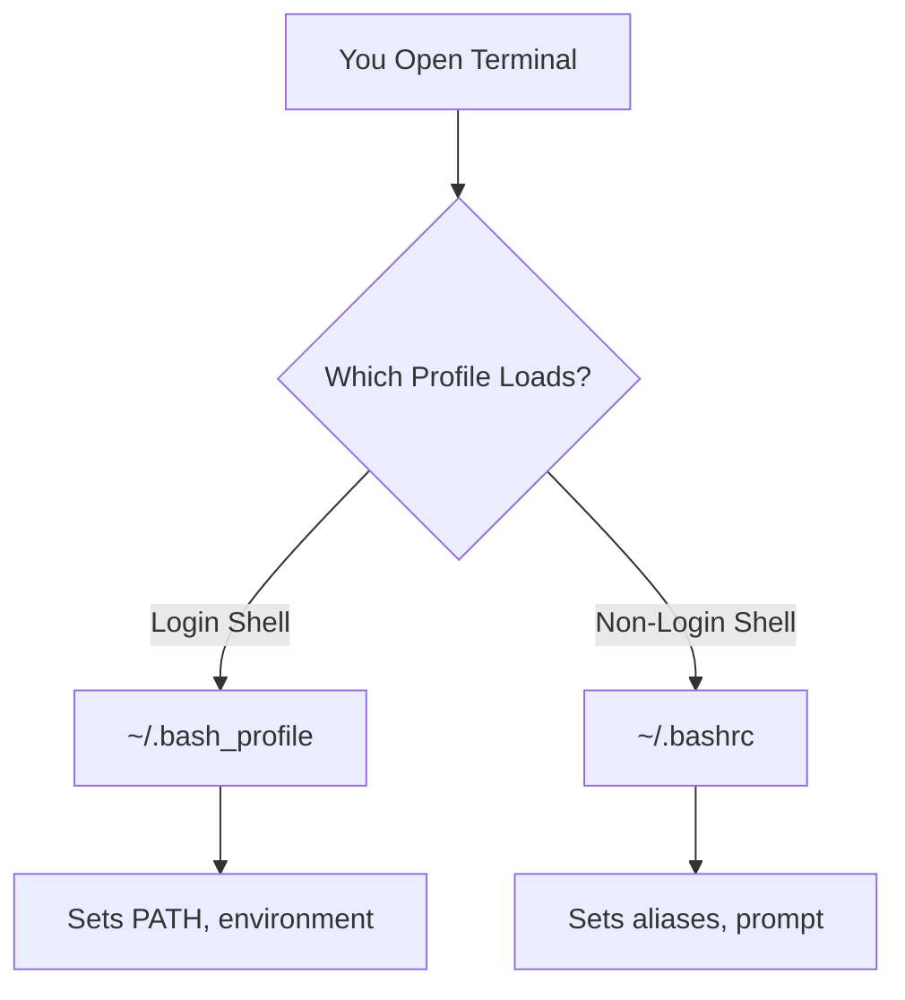

**File Locations & Purpose:**

| File | When It Runs | Purpose | Example |
|------|--------------|---------|---------|
| `~/.bash_profile` | Login (first terminal) | Environment setup | `export PATH=$PATH:/usr/local/bin` |
| `~/.bashrc` | Every new terminal | Aliases & functions | `alias ll='ls -la'` |
| `~/.profile` | System-wide fallback | Basic settings | Universal configs |
| `/etc/profile` | ALL users login | System defaults | Company-wide settings |

### 🪟 PowerShell Profiles

**Profile Locations:**

| Scope | Path | Who Uses It |
|-------|------|-------------|
| Current User | `$HOME\Documents\PowerShell\profile.ps1` | Just you |
| All Users | `$PSHOME\profile.ps1` | Everyone on PC |
| VS Code specific | `$HOME\Documents\PowerShell\Microsoft.VSCode_profile.ps1` | Only in VS Code |

```powershell
# Check your profile location
$PROFILE

# Create if doesn't exist
New-Item -Path $PROFILE -Type File -Force

# Example profile content
Set-Alias ll Get-ChildItem
function touch { New-Item $args }
```

### 🎯 Real-World Example

```bash
# ~/.bashrc - Your personal assistant
# Runs every time you open terminal

# Shortcuts
alias desktop='cd ~/Desktop'
alias ..='cd ..'
alias gs='git status'

# Colored prompt
PS1='\[\033[01;32m\]\u@\h\[\033[00m\]:\[\033[01;34m\]\w\[\033[00m\]\$ '

# Welcome message
echo "Welcome back, $(whoami)! Today is $(date)"
```

---

## 📁 7.6 File Systems — *Ubuntu vs Windows Organization*

### 🗺️ The Big Picture

Think of file systems like two different ways to organize a library:
- **Windows:** Uses letters (C:, D:) like building wings
- **Linux/Ubuntu:** One big tree starting from root (/) like floors in a building

### 🐧 Ubuntu/Linux File Structure

```mermaid
graph TD
  A[/ Root - The Foundation] --> B[/home - User Apartments]
  A --> C[/etc - Config Office]
  A --> D[/usr - Shared Programs]
  A --> E[/var - Storage Room]
  B --> F[/home/username - Your Room]
  F --> G[Documents, Downloads, Desktop]
```

| Folder | Purpose | Like... |
|--------|---------|---------|
| `/` | Root of everything | Building foundation |
| `/home/username` | Your personal space | Your apartment |
| `/etc` | System configurations | Building management office |
| `/usr/bin` | Installed programs | Tool shed |
| `/tmp` | Temporary files | Scratch paper |
| `/var/log` | System logs | Security cameras |

### 🪟 Windows File Structure

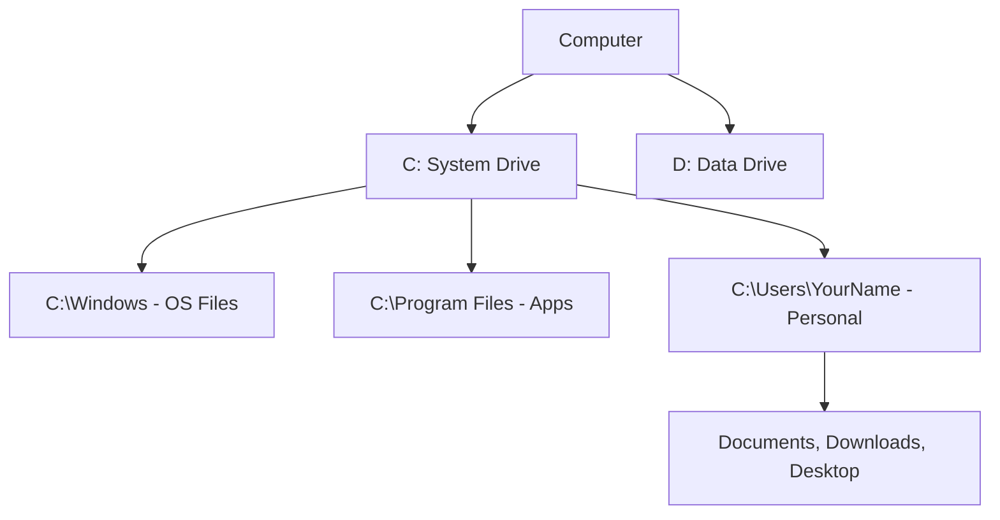

| Folder | Purpose | Like... |
|--------|---------|---------|
| `C:\` | Main system drive | Main building |
| `C:\Windows` | Operating system | Building infrastructure |
| `C:\Program Files` | Installed software | Office spaces |
| `C:\Users\YourName` | Your personal folder | Your office |
| `D:\` (if exists) | Extra storage | Storage building |

### 🆚 Key Differences

| Aspect | Ubuntu/Linux | Windows |
|--------|--------------|---------|
| Path separator | `/` (forward slash) | `\` (backslash) |
| Home folder | `/home/username` | `C:\Users\Username` |
| Hidden files | Start with `.` (dot) | Hidden attribute |
| Case sensitive | YES (File ≠ file) | NO (File = file) |
| Drives | Everything under `/` | Separate letters (C:, D:) |

### 🏠 Where Your Stuff Lives

```bash
# Ubuntu
cd ~                    # Goes to /home/yourusername
cd ~/Documents         # Your documents
cd /                   # Root of system

# Windows
cd %USERPROFILE%       # Goes to C:\Users\YourName
cd %USERPROFILE%\Documents  # Your documents
cd C:\                 # Root of C drive
```

---

## 🌐 11. Servers and How Everything Connects

```mermaid
graph LR
A[User (Browser)] --> B[🌐 Web Server]
B --> C[🧠 Application Server (Python, Node.js)]
C --> D[🗄️ Database Server (SQL)]
C --> F[⚙️ Config (YAML, JSON)]
B --> E[📄 HTML + JS + CSS Sent Back]
E --> G[DOM Rendered in Browser]
```

---

## 🧩 12. Summary Table

| Category | Example Languages | Role | Type | Needs to Run |
|-----------|-------------------|------|------|---------------|
| **Markup** | HTML, XML, Markdown | Structure & content | Descriptive | Browser or parser |
| **Data / Config** | JSON, YAML | Store/share structured data | Descriptive | Application |
| **Programming** | Python, JavaScript, C# | Logic & computation | Prescriptive | Interpreter/compiler |
| **Query** | SQL | Request & modify data | Declarative | Database engine |
| **Scripting (Shell)** | Bash, PowerShell | Automate OS tasks | Prescriptive | Shell interpreter |

### 🎯 Infrastructure Comparison

| Component | Purpose | Analogy | Example |
|-----------|---------|---------|---------|
| **Web Server** | Delivers web pages | Restaurant waiter | Apache, Nginx |
| **DOM** | Live page structure | Actual building | `document.getElementById()` |
| **Virtual DOM** | Efficient updates | Architect's notepad | React's reconciliation |
| **File System** | Organize files | Library shelving | C:\ (Windows), / (Linux) |
| **WSL** | Linux on Windows | Universal translator | Ubuntu in Windows |

---

## 🧭 14. Big Picture Mind Map

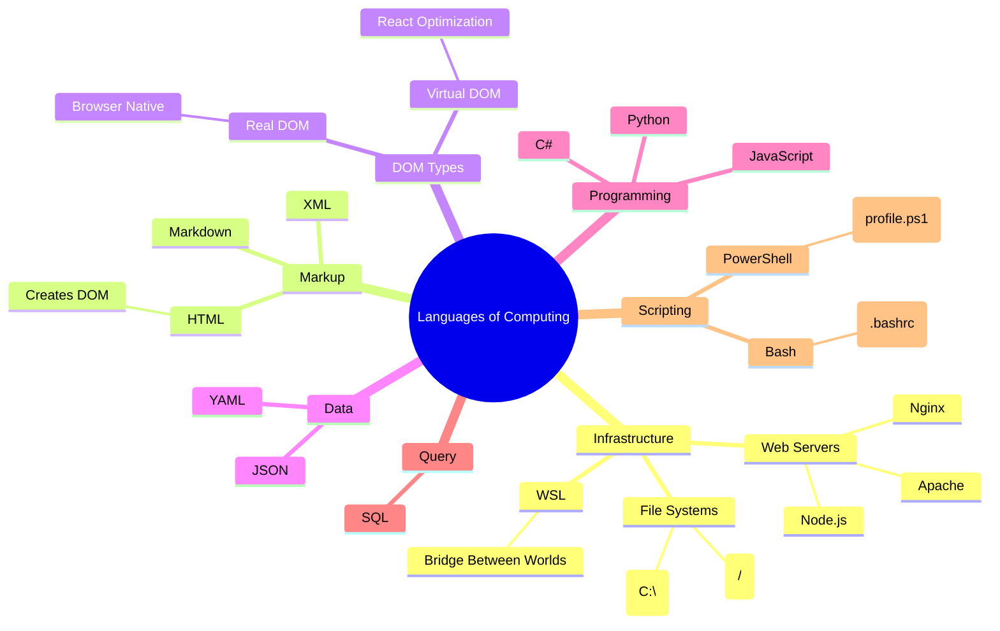

---

## 🌈 15. In Summary

- **Web Servers** → the waiters that serve web pages to browsers
- **Markup (HTML, XML)** → describes *what things are*  
- **DOM** → the live, interactive version of your HTML in the browser
- **Virtual DOM** → React's smart notepad for efficient updates
- **JSON/YAML** → store and exchange *structured data*  
- **Programming (Python, JS)** → tell the computer *what to do*  
- **SQL** → tells the database *what data to get or change*  
- **Bash/PowerShell** → tell the operating system *how to act*
- **Shell Profiles** → your personal terminal settings that load automatically
- **File Systems** → Windows uses drive letters (C:\), Linux uses one tree (/)
- **WSL** → lets you run Linux inside Windows - best of both worlds!
- **Servers** → connect it all by sending, storing, and processing data  

Everything has a **role**, a **reason**, and a **runtime**. 🧩

---

## 🌉 13. WSL — *Windows Subsystem for Linux*

### 🤝 What is WSL?

WSL is like having a **Linux computer inside your Windows computer**. It's a translator that lets Linux programs run on Windows.

**Analogy:** Imagine having a Japanese translator in your pocket who lets you speak to Japanese people even though you only know English.

### 🎯 Why Use WSL?

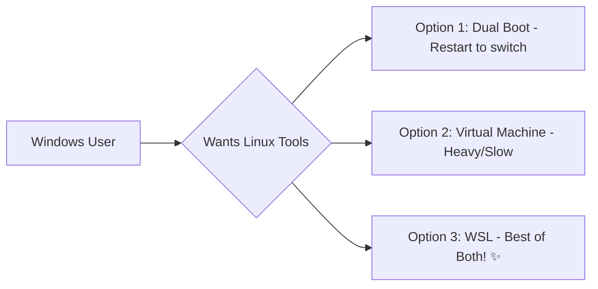

### 🏗️ How WSL Works

Think of it as **three layers:**

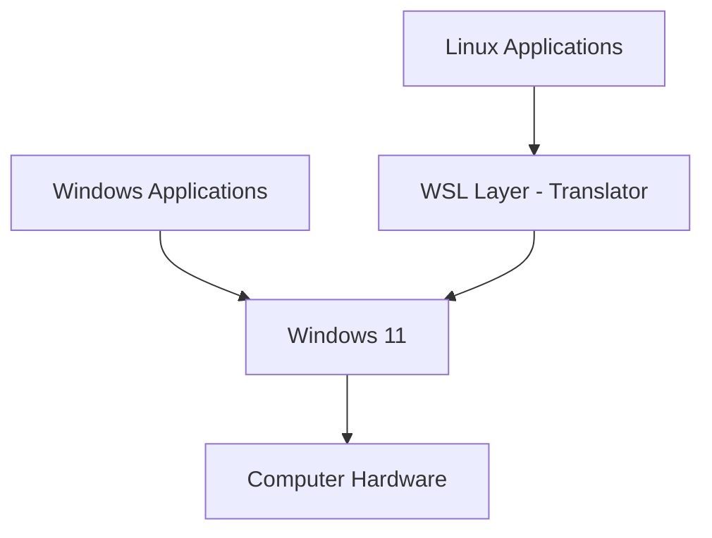

### 🚀 WSL in Action

```bash
# In Windows Terminal/PowerShell
wsl --install                    # Installs WSL and Ubuntu

# Now you can use Linux commands!
wsl                             # Enter Linux world
pwd                             # Shows: /home/username
ls -la                          # Linux style listing
apt update                      # Linux package manager

# Magic: Access Windows files from Linux!
cd /mnt/c/Users/YourName/Desktop  # Your Windows desktop!
```

### 🗂️ File System Magic

| Location | From Windows | From WSL/Linux |
|----------|--------------|----------------|
| Windows C: drive | `C:\` | `/mnt/c/` |
| Your Windows Desktop | `C:\Users\Name\Desktop` | `/mnt/c/Users/Name/Desktop` |
| WSL home | `\\wsl$\Ubuntu\home\username` | `/home/username` |
| Copy file to Linux | Drag to `\\wsl$\Ubuntu\home` | `cp /mnt/c/file.txt ~/` |

### 💡 Real-World Examples

**Example 1: Web Development**
```bash
# In WSL terminal
mkdir my-website
cd my-website
npm init                        # Node.js works perfectly
code .                          # Opens VS Code in Windows!
```

**Example 2: Python Development**
```bash
# WSL gives you "real" Linux Python
python3 -m venv myenv          # Virtual environment
source myenv/bin/activate      # Works like real Linux
pip install django             # No Windows path issues!
```

### 🎮 WSL Commands Cheat Sheet

| Command | What it does |
|---------|--------------|
| `wsl` | Enter default Linux distro |
| `wsl --list` | Show installed Linux distros |
| `wsl --shutdown` | Stop WSL |
| `explorer.exe .` | Open Windows Explorer here |
| `code .` | Open VS Code from WSL |
| `wsl hostname -I` | Get WSL IP address |

### 🌟 Best of Both Worlds

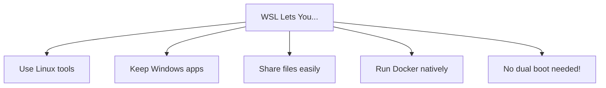

### ⚡ Pro Tips

1. **Performance:** Keep project files in WSL filesystem (`~/projects`) not Windows (`/mnt/c/`)
2. **Terminal:** Use Windows Terminal for best experience
3. **GUI Apps:** WSL2 supports Linux GUI apps too!
4. **Docker:** Runs MUCH better in WSL than Windows

### 🆚 WSL 1 vs WSL 2

| Feature | WSL 1 | WSL 2 |
|---------|--------|--------|
| Speed | Good | Excellent |
| Linux kernel | Translated | Real Linux kernel |
| Memory usage | Shared with Windows | Separate VM |
| File performance | Fast in Windows | Fast in Linux |
| Docker support | Limited | Full support |

**Think of WSL as:** Your Windows PC learned to speak Linux! 🐧💙🪟

---