# 🌟 Git & GitHub Guide — Version Control for Beginners

A visual, practical guide to understand Git, GitHub, and how to use them like a pro!

---

## 📚 Table of Contents
1. [What is Git? — The Time Machine](#-1-what-is-git--the-time-machine)
2. [Git vs GitHub — Local vs Cloud](#-2-git-vs-github--local-vs-cloud)
3. [Core Concepts — The Building Blocks](#-3-core-concepts--the-building-blocks)
4. [Branches — Parallel Universes](#-4-branches--parallel-universes)
5. [Branch Naming Conventions](#-5-branch-naming-conventions)
6. [Basic Git Commands — Terminal](#-6-basic-git-commands--terminal)
7. [Git in VS Code — Visual Way](#-7-git-in-vs-code--visual-way)
8. [Merging — Bringing Changes Together](#-8-merging--bringing-changes-together)
9. [Remote & Upstream — Cloud Connections](#-9-remote--upstream--cloud-connections)
10. [Git Credential Manager — One Login Everywhere](#-10-git-credential-manager--one-login-everywhere)
11. [Complete Workflow Example](#-11-complete-workflow-example)
12. [Troubleshooting Common Issues](#-12-troubleshooting-common-issues)

---

## 🕰️ 1. What is Git? — *The Time Machine*

### 📖 Simple Definition

Git is like a **time machine for your code**. It lets you:
- Save snapshots of your work
- Go back to any previous version
- Work with others without messing up each other's code

### 🎮 Real-World Analogy

Think of Git like **video game saves**:

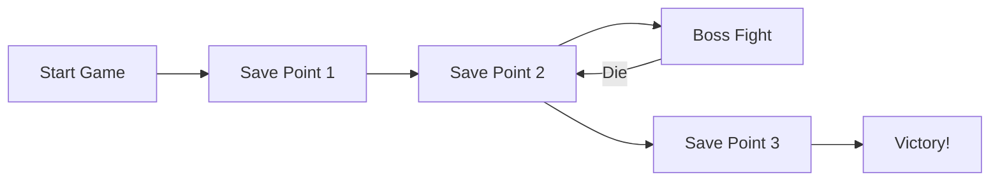

You can always go back to any save point if things go wrong!

---

## ☁️ 2. Git vs GitHub — *Local vs Cloud*

### 🏠 Understanding the Difference

| Git | GitHub |
|-----|--------|
| 📦 Software on YOUR computer | 🌐 Website on the internet |
| 💾 Saves your code history locally | ☁️ Backs up your code online |
| 🖥️ Works offline | 🌍 Share with the world |
| 🛠️ The tool | 🏢 The storage service |

### 🎯 Analogy

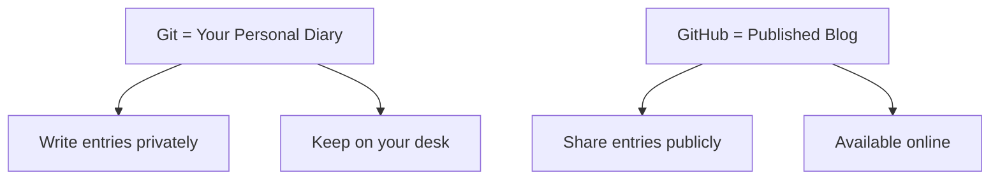

**Think of it as:**
- **Git** = Microsoft Word (the program)
- **GitHub** = Google Docs (the online service)

---

## 🧱 3. Core Concepts — *The Building Blocks*

### 📸 Key Terms Explained

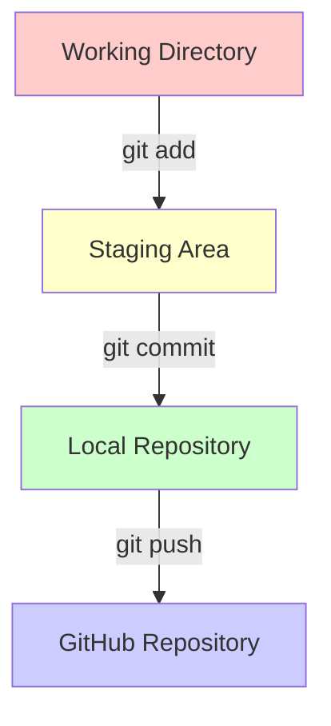

### 🏭 The Factory Analogy

1. **Working Directory** = Your workbench (where you build)
2. **Staging Area** = Quality check area (what you're about to save)
3. **Commit** = Sealed package with timestamp
4. **Repository** = Warehouse storing all packages

### 📦 What is a Commit?

A commit is like a **snapshot** of your entire project at a moment in time.

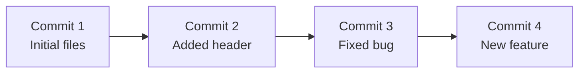

Each commit has:
- 🏷️ Unique ID (like `a3f8b2c`)
- 📝 Message (like "Fixed login bug")
- 👤 Author (you!)
- 🕐 Timestamp

---

## 🌳 4. Branches — *Parallel Universes*

### 🚂 The Train Track Analogy

Branches are like **train tracks** that split and merge:

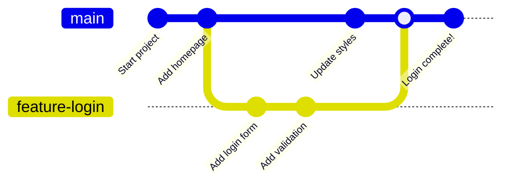

### 🎯 Why Use Branches?

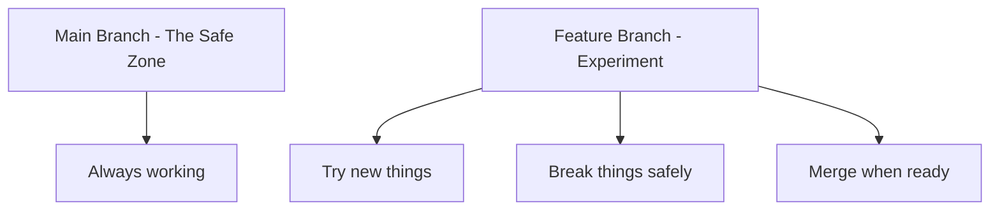

**Benefits:**
- 🛡️ Keep main branch stable
- 🧪 Experiment without fear
- 👥 Multiple people work simultaneously
- ✅ Review before merging

---

## 📝 5. Branch Naming Conventions

### 🏷️ Professional Naming Standards

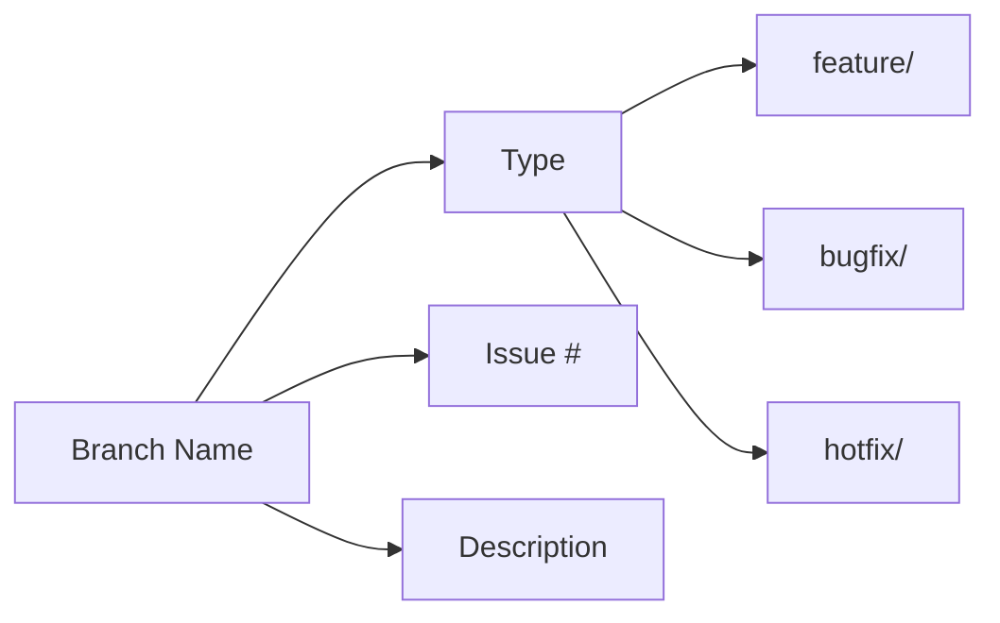

### 📋 Recommended Convention: `type/issue-number-short-description`

| Type | When to Use | Example |
|------|-------------|---------|
| `feature/` | New functionality | `feature/23-add-user-login` |
| `bugfix/` | Fixing bugs | `bugfix/45-fix-navbar-color` |
| `hotfix/` | Urgent production fixes | `hotfix/67-critical-payment-bug` |
| `chore/` | Maintenance, no user impact | `chore/12-update-dependencies` |

### ✅ Good vs ❌ Bad Names

```bash
# ✅ GOOD - Clear and descriptive
feature/89-add-shopping-cart
bugfix/102-fix-mobile-menu
feature/156-user-profile-page

# ❌ BAD - Unclear or too personal
my-branch
fix
johns-work
new-stuff
```

### 🎯 Pro Tips

1. **Keep it short** but descriptive
2. **Use hyphens** not spaces
3. **Include ticket number** if you have one
4. **Be specific** about what it does

---

## 💻 6. Basic Git Commands — *Terminal*

### 🚀 Essential Commands

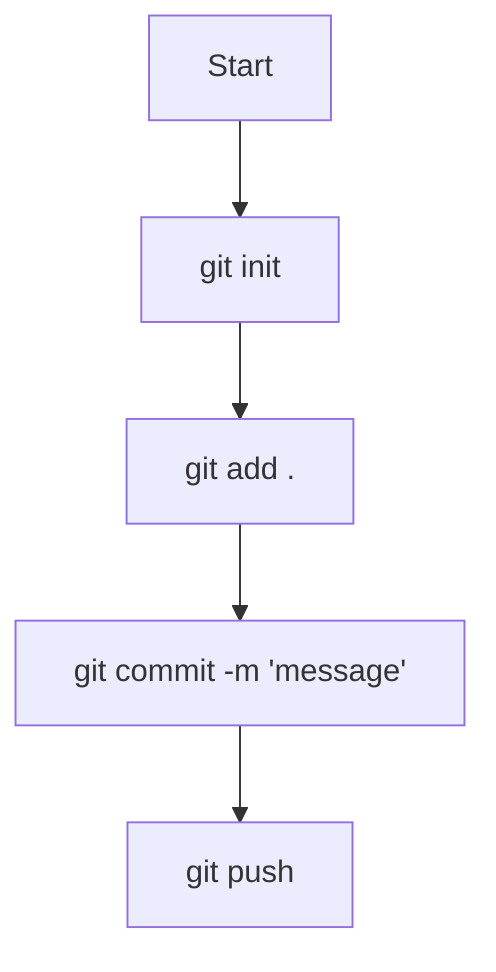

### 📋 Command Cheat Sheet

| Command | What it Does | When to Use |
|---------|--------------|-------------|
| `git init` | Create new repository | Starting a new project |
| `git clone [url]` | Download from GitHub | Getting existing project |
| `git status` | Check what's changed | Before adding/committing |
| `git add .` | Stage all changes | Before committing |
| `git commit -m "msg"` | Save snapshot | After adding files |
| `git push` | Upload to GitHub | Share your work |
| `git pull` | Download updates | Get teammate's changes |
| `git branch` | List branches | See available branches |
| `git checkout -b [name]` | Create & switch branch | Start new feature |
| `git merge [branch]` | Combine branches | Feature complete |

### 🎮 Real Example Workflow

```bash
# 1. Clone a project
git clone https://github.com/company/project.git
cd project

# 2. Create your feature branch
git checkout -b feature/23-add-login-form

# 3. Make changes, then stage them
git add .
git status  # Always check!

# 4. Commit with descriptive message
git commit -m "feat: Add login form with email validation"

# 5. Push to GitHub
git push origin feature/23-add-login-form
```

### 💬 Commit Message Tips

```bash
# ✅ GOOD commit messages
git commit -m "fix: Resolve navigation menu overlap on mobile"
git commit -m "feat: Add user authentication with JWT"
git commit -m "docs: Update README with setup instructions"

# ❌ BAD commit messages
git commit -m "fixed stuff"
git commit -m "asdfasdf"
git commit -m "work"
```

---

## 🎨 7. Git in VS Code — *Visual Way*

### 🖱️ VS Code Git Integration

VS Code has Git built-in! Here's how to use it:

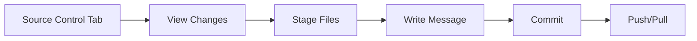

### 📸 Visual Guide

1. **Source Control Panel** (Ctrl+Shift+G)
   - Shows all changed files
   - Green = new files
   - Yellow = modified files
   - Red = deleted files

2. **Staging Changes**
   - Click `+` to stage individual files
   - Click `+` on "Changes" to stage all

3. **Committing**
   - Type message in text box
   - Ctrl+Enter to commit

4. **Sync Changes**
   - Click `...` → Push/Pull
   - Or click sync icon

### ⌨️ VS Code Shortcuts

| Action | Shortcut | What it Does |
|--------|----------|--------------|
| Open Source Control | `Ctrl+Shift+G` | View Git panel |
| Stage All | Click `+` on Changes | Add all files |
| Commit | `Ctrl+Enter` | Commit staged |
| Open Terminal | `` Ctrl+` `` | For Git commands |

### 🎯 VS Code Git Features

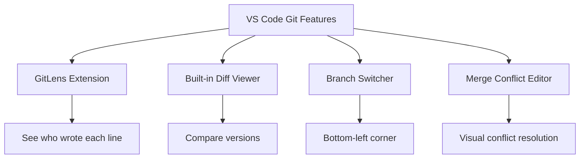

---

## 🔀 8. Merging — *Bringing Changes Together*

### 🏗️ Types of Merges

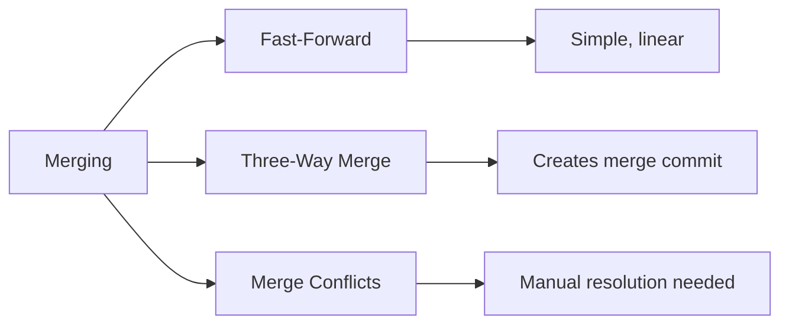

### ✅ Successful Merge

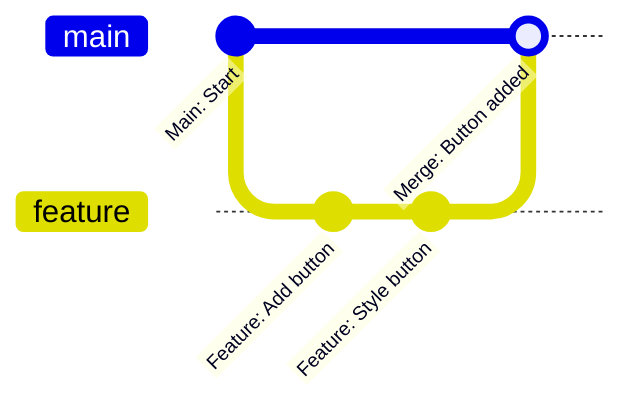

### ⚠️ Merge Conflicts

When two people change the same line:

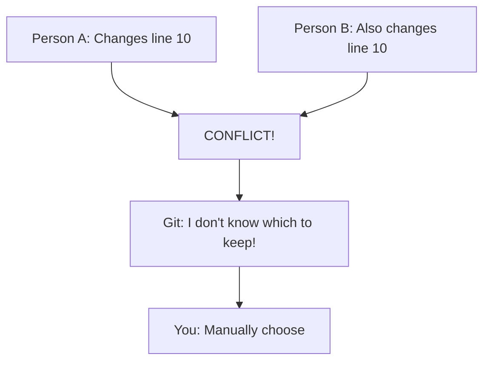

**Conflict Resolution:**

```bash
<<<<<<< HEAD
const color = "blue";  # Your change
=======
const color = "red";   # Their change
>>>>>>> feature-branch

# You decide and clean up:
const color = "blue";  # Keep yours, delete markers
```

---

## 🌐 9. Remote & Upstream — *Cloud Connections*

### 🔗 Understanding Remotes

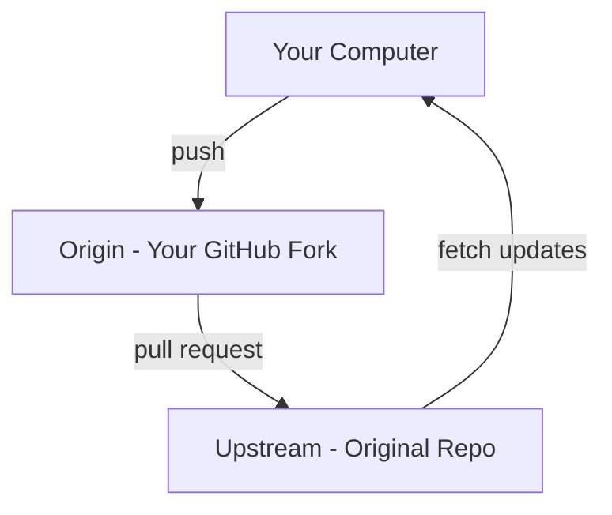

### 📍 Remote Concepts

| Term | What it Means | Example |
|------|---------------|---------|
| **origin** | YOUR GitHub repository | `https://github.com/YOU/project` |
| **upstream** | ORIGINAL repository | `https://github.com/COMPANY/project` |
| **remote** | Any GitHub repository | Could be origin, upstream, etc. |

### 🔄 Common Remote Commands

```bash
# View your remotes
git remote -v

# Add upstream (original repo)
git remote add upstream https://github.com/company/project.git

# Get latest from upstream
git fetch upstream
git checkout main
git merge upstream/main

# Push to your fork
git push origin feature/my-feature
```

### 🎯 Fork Workflow

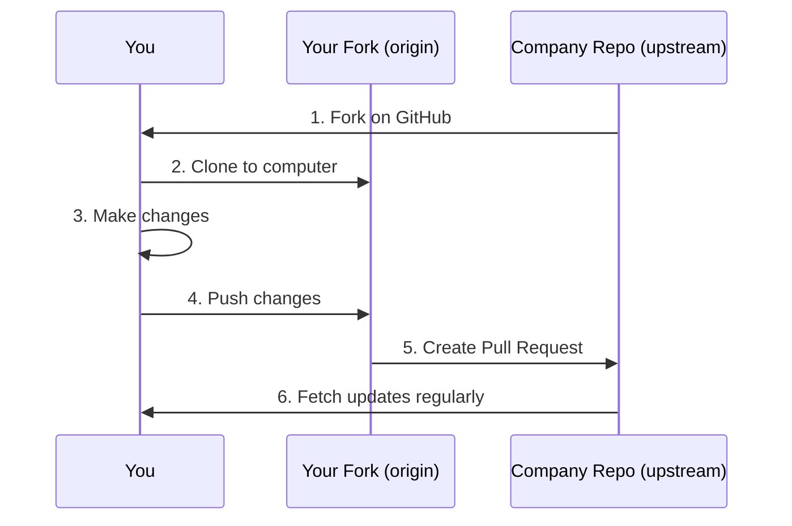

---

## 🔐 10. Git Credential Manager — *One Login Everywhere*

### 🔑 What is Git Credential Manager?

It's like a **password manager for Git** that works across Windows, WSL, and VS Code!

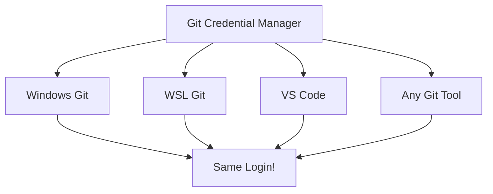

### 🪟 Setup on Windows

```bash
# 1. Install Git for Windows (includes GCM)
# Download from: https://git-scm.com/download/win

# 2. Configure Git
git config --global user.name "Your Name"
git config --global user.email "your.email@example.com"

# 3. Set credential manager
git config --global credential.helper manager
```

### 🐧 Setup on WSL

```bash
# 1. Configure WSL to use Windows' Git Credential Manager
git config --global credential.helper "/mnt/c/Program\ Files/Git/mingw64/bin/git-credential-manager.exe"

# 2. Set your identity (same as Windows)
git config --global user.name "Your Name"
git config --global user.email "your.email@example.com"

# 3. Test it
git clone https://github.com/your-private-repo.git
# Should prompt ONCE, then remember!
```

### 🎯 How It Works

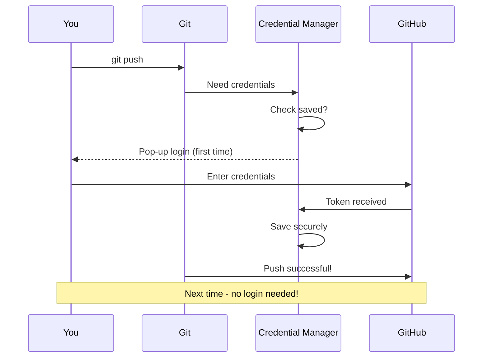

### ✅ Benefits

- 🔐 Login once, use everywhere
- 🔒 Secure token storage
- 🌐 Works with 2FA
- 💻 Same login in Windows & WSL
- 🔄 Auto-refresh tokens

---

## 🎬 11. Complete Workflow Example

### 📖 Story: Adding a New Feature

Let's build a "Contact Us" page step by step:

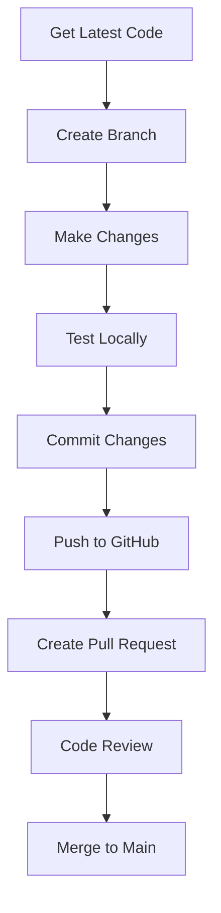

### 💻 Step-by-Step Commands

```bash
# 1. Start fresh - get latest code
git checkout main
git pull origin main

# 2. Create feature branch with naming convention
git checkout -b feature/45-add-contact-page

# 3. Make your changes
# ... edit contact.html, styles.css ...

# 4. Check what changed
git status
git diff  # See actual changes

# 5. Stage and commit
git add .
git commit -m "feat: Add contact page with form validation"

# 6. Push to GitHub
git push origin feature/45-add-contact-page

# 7. Go to GitHub and create Pull Request
# Click "Compare & pull request" button
# Add description of changes
# Request review from teammate

# 8. After approval, merge on GitHub
# Delete branch after merge
```

### 🔄 Keeping Branch Updated

```bash
# If main gets updated while you work:
git checkout main
git pull origin main
git checkout feature/45-add-contact-page
git merge main

# Resolve any conflicts, then:
git add .
git commit -m "merge: Update branch with latest main"
git push origin feature/45-add-contact-page
```

---

## 🔧 12. Troubleshooting Common Issues

### 😱 Common Problems & Solutions

#### Problem 1: "I committed to main by mistake!"

```bash
# Solution: Move commit to new branch
git branch feature/oops-fix
git reset HEAD~1 --hard
git checkout feature/oops-fix
```

#### Problem 2: "I need to undo my last commit"

```bash
# Undo but keep changes
git reset HEAD~1

# Undo and discard changes (careful!)
git reset HEAD~1 --hard
```

#### Problem 3: "Git says I have conflicts"

```bash
# 1. See what's conflicting
git status

# 2. Open conflicted files
# 3. Look for <<<<<<< markers
# 4. Choose what to keep
# 5. Remove conflict markers
# 6. Save, add, and commit
git add .
git commit -m "resolve: Fix merge conflicts"
```

#### Problem 4: "I forgot to pull before starting"

```bash
# Stash your changes temporarily
git stash

# Get latest
git pull origin main

# Bring back your changes
git stash pop
```

### 🏁 Quick Fixes Cheat Sheet

| Situation | Command | What it Does |
|-----------|---------|--------------|
| See changes | `git diff` | Show what changed |
| Undo staging | `git reset` | Unstage files |
| Undo commit | `git reset HEAD~1` | Undo last commit |
| Save work temporarily | `git stash` | Hide changes |
| Bring back stashed | `git stash pop` | Restore changes |
| See history | `git log --oneline` | View commits |
| Emergency exit | `git merge --abort` | Cancel merge |

---

## 🎯 Summary Mind Map

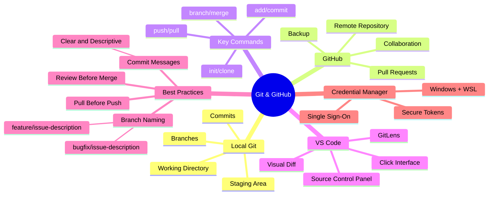

---

## 🚀 You're Ready!

Now you can:
- ✅ Create branches with proper naming
- ✅ Understand Git's core concepts
- ✅ Use Git in terminal and VS Code
- ✅ Handle merging and conflicts
- ✅ Work with remotes and upstreams
- ✅ Use one login everywhere with GCM

**Remember:** Git is like riding a bike - scary at first, but muscle memory after practice! 🚴‍♀️

---

## 📚 Quick Reference Card

```bash
# Daily Workflow
git pull                               # Start your day
git checkout -b feature/123-new-thing  # New feature
git add . && git commit -m "feat: .."  # Save work
git push origin feature/123-new-thing  # Share work

# Stay Updated
git fetch upstream                     # Get updates
git merge upstream/main                # Apply updates

# Fix Mistakes
git stash                             # Hide changes
git reset HEAD~1                      # Undo commit
git checkout .                        # Discard changes
```

Happy Coding! 🎉